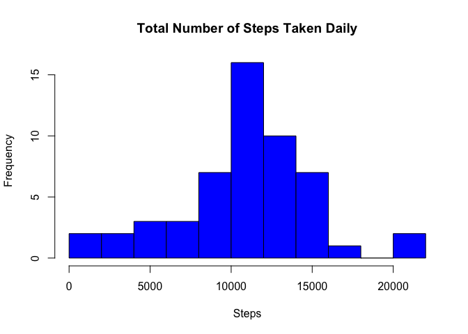
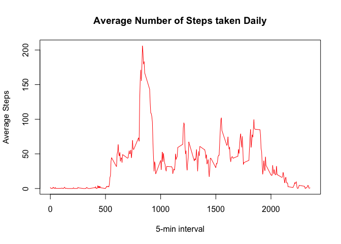
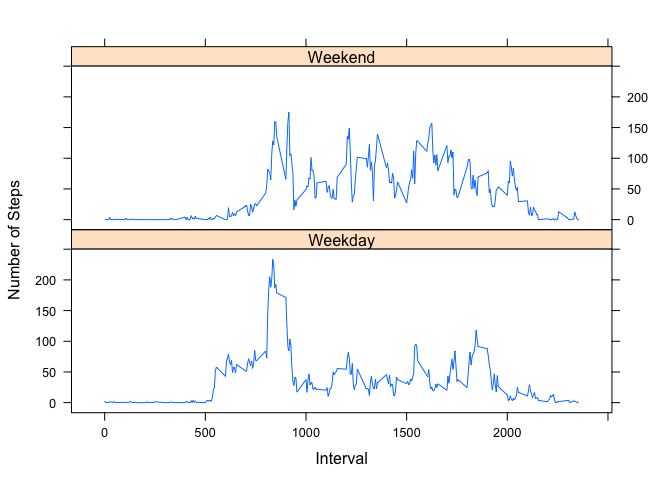

# Reproducible Research: Peer Assessment 1

##Loading and preprocessing the data

```r
activity <- read.csv("./activity.csv", colClasses = c("numeric", "character", "numeric"))
head(activity)
```

```
##   steps       date interval
## 1    NA 2012-10-01        0
## 2    NA 2012-10-01        5
## 3    NA 2012-10-01       10
## 4    NA 2012-10-01       15
## 5    NA 2012-10-01       20
## 6    NA 2012-10-01       25
```


##What is mean total number of steps taken per day?

Data will be arrgregated by date, and will be plotted on histogram

```r
dailySteps <- aggregate(steps ~ date, data = activity, sum, na.rm = TRUE)
hist(dailySteps$steps, main="Total Number of Steps Taken Daily", breaks=10, xlab="Steps", ylab="Frequency", col="Blue")
```

 

Mean and Median of this results are

```r
mean(dailySteps$steps)
```

```
## [1] 10766.19
```

```r
median(dailySteps$steps)
```

```
## [1] 10765
```


##What is the average daily activity pattern?
Make a time series plot (i.e. type = "l") of the 5-minute interval (x-axis) and the average number of steps taken, averaged across all days (y-axis)

Get time series data using tapply function and plot as below.

```r
timeSeries <- tapply(activity$steps, activity$interval, mean, na.rm = TRUE)
plot(row.names(timeSeries), timeSeries, type = "l", xlab = "5-min interval", 
     ylab = "Average Steps", main = "Average Number of Steps taken Daily", 
     col = "red")
```

 

Now, display the 5-minute interval which contains maximum number of steps, on average across all the days in the dataset. 

```r
names(which.max(timeSeries))
```

```
## [1] "835"
```


##Imputing missing values
Calculate and report the total number of missing values in the dataset

```r
activityNA <- sum(is.na(activity))
activityNA
```

```
## [1] 2304
```

Use interval average for filling in all of the missing values in the dataset

```r
stepsAverage <- aggregate(steps ~ interval, data = activity, FUN = mean)
fillNA <- numeric()
for (i in 1:nrow(activity)) {
  obs <- activity[i, ]
  if (is.na(obs$steps)) {
    steps <- subset(stepsAverage, interval == obs$interval)$steps
  } else {
    steps <- obs$steps
  }
  fillNA <- c(fillNA, steps)
}
```

Create a new dataset that is equal to the original dataset but with the missing data filled in.

```r
newActivity <- activity
newActivity$steps <- fillNA

newDailySteps <- aggregate(steps ~ date, data = activity, sum, na.rm = TRUE)
hist(newDailySteps$steps, main="Total Number of Steps Taken Daily", breaks=10, xlab="Steps", ylab="Frequency", col="Blue")
```

 

Now, display mean and median of new data set - newDailySteps

```r
mean(newDailySteps$steps)
```

```
## [1] 10766.19
```

```r
median(newDailySteps$steps)
```

```
## [1] 10765
```

##Are there differences in activity patterns between weekdays and weekends?

Create a new factor variable in the dataset with two levels ??? ???weekday??? and ???weekend??? indicating whether a given date is a weekday or weekend day.

So, differentiate date into two groups - weekday and weekend first.

```r
day <- weekdays(as.Date(activity$date))
daylevel <- vector()
for (i in 1:nrow(activity)){
  if(day[i] == "Saturday"){
    daylevel[i] <- "Weekend"
  }
  else if (day[i] == "Sunday"){
    daylevel[i] <- "Weekend"
  }
  else {
    daylevel[i] <- "Weekday"
  }
}
activity$daylevel <- daylevel
activity$daylevel <- factor(activity$daylevel)
```

Using daylevel factor, generate new aggregated data by factor value.

```r
stepsByDay <- aggregate(steps ~ interval + daylevel, data = activity, mean)
names(stepsByDay) <- c("interval", "daylevel", "steps")
```

Make a panel plot containing a time series plot (i.e. type = "l") of the 5-minute interval (x-axis) and the average number of steps taken, averaged across all weekday days or weekend days (y-axis). 

```r
library(lattice)
xyplot(steps ~ interval | daylevel, stepsByDay, type = "l",
       layout = c(1, 2), xlab = "Interval", ylab = "Number of Steps")
```

 
